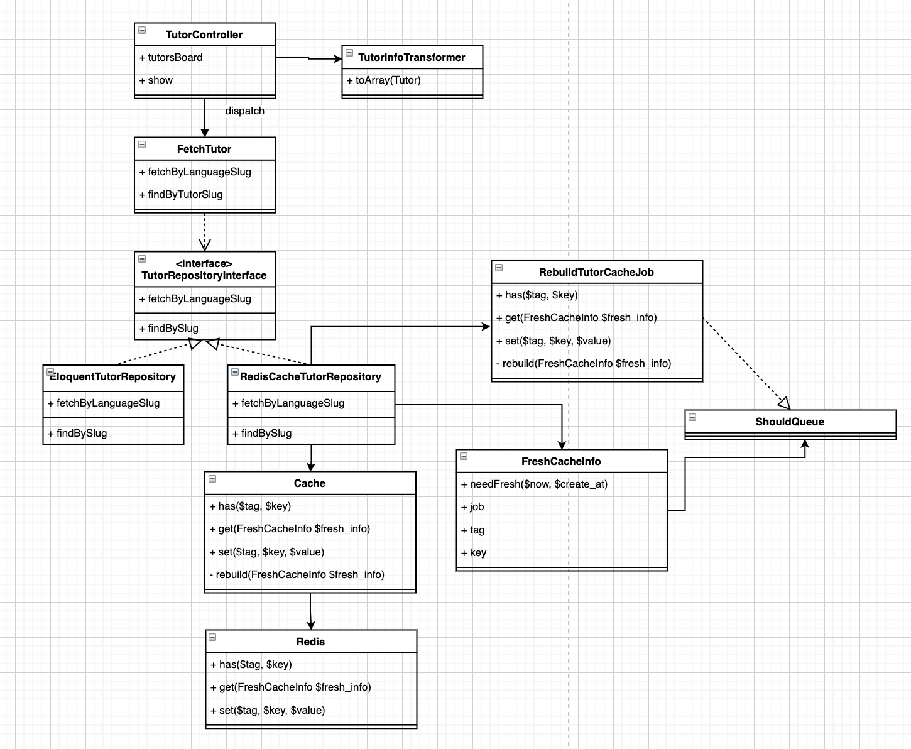

## Spec
### 說明

請實作兩隻API，分別是教師列表以及教師個人資訊API並**透過快取回傳資料**

快取（cache）機制，規則如下:

1. 用戶端發送請求 -> 有快取 -> 快取建立的時間超過 X 分鐘 -> 觸發「刷新快取的工作（job）」到佇列由背景執行 -> 先回傳目前快取的資料給用戶端
1. 用戶端發送請求 -> 沒有快取 -> 從資料庫取得資料 -> 寫入到快取 -> 回傳資料給用戶端

### 需求規範

- API 1 教師列表 路徑： **/api/tutors/{language.slug}**
- API 2 教師個人資訊 路徑： **/api/tutor/{tutor.slug}**


## 專案介紹
語言：PHP
框架：Laravel 5.6

### routes
- src/routes/api.php

### 主要程式
- ./src/app/Modules/Tutor
- ./src/app/Modules/Shared/Cache



## Local IP Mapping
```
// local
$ sudo vim /etc/hosts

// 填上
127.0.0.1 api-demo.local
```

## 環境建置 (Docker Container)

- php:7.4-fpm
- nginx:1.16-alpine
- mysql:5.6
- redis:6.2.3

```
$ cd ./docker
$ docker-compose up -d
```

## Postman
匯入即可使用
- ./TestProject.postman_collection.json
